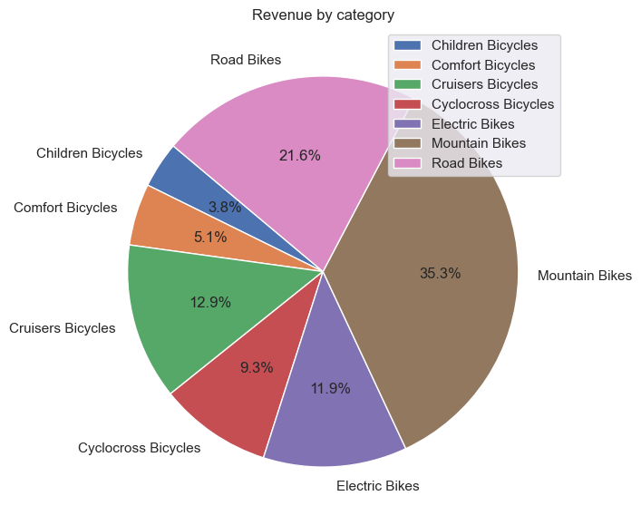
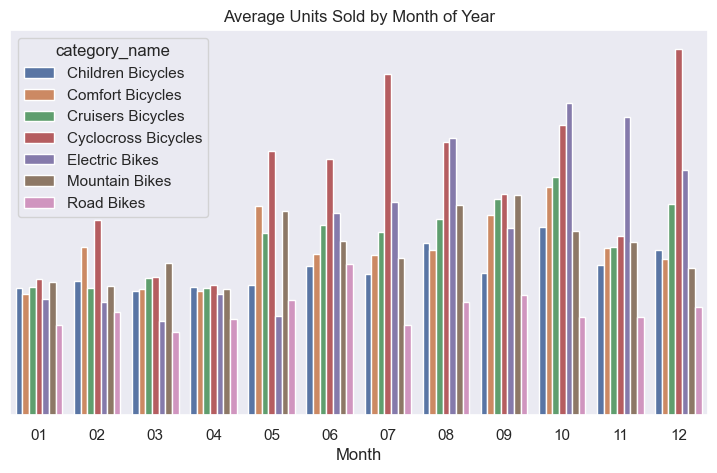

# Case Study: Bike Store

**Author**: Chang Jia Jun, **Date**: 5/22/2026

## Objectives
This is a walkthrough of data science fundamentals using SQL and Python, focusing on clarity and simplicity.  
Analyze a fictional dataset of bike retail store orders with data using Python and SQL to uncover business insights, identify trends, and provide actionable recommendations. 

## Background
The fictional bike store is a relational database designed for teaching SQL and analytics. The dataset models typical retail entities (brands, categories, products, customers, orders, order_items, stocks, staffs, and stores) and is provided as CSV files in the `input\bike-store-sample-database` folder.

This project demonstrates common data analysis workflows: extracting and joining relational data, cleaning and transforming CSVs, exploratory data analysis with Python, simple SQL analytics (sales by product/store, customer segmentation), and visualizations for business insights. The notebook includes reproducible steps to calculate KPIs (revenue, average order value, top-selling products) and time-based trends.

Contents:
- `notebook.ipynb` — main analysis notebook.
- `requirements.txt` — Python package dependencies.
- `input\bike-store-sample-database` — dataset CSV files.

References:
- https://www.kaggle.com/datasets/dillonmyrick/bike-store-sample-database/data
